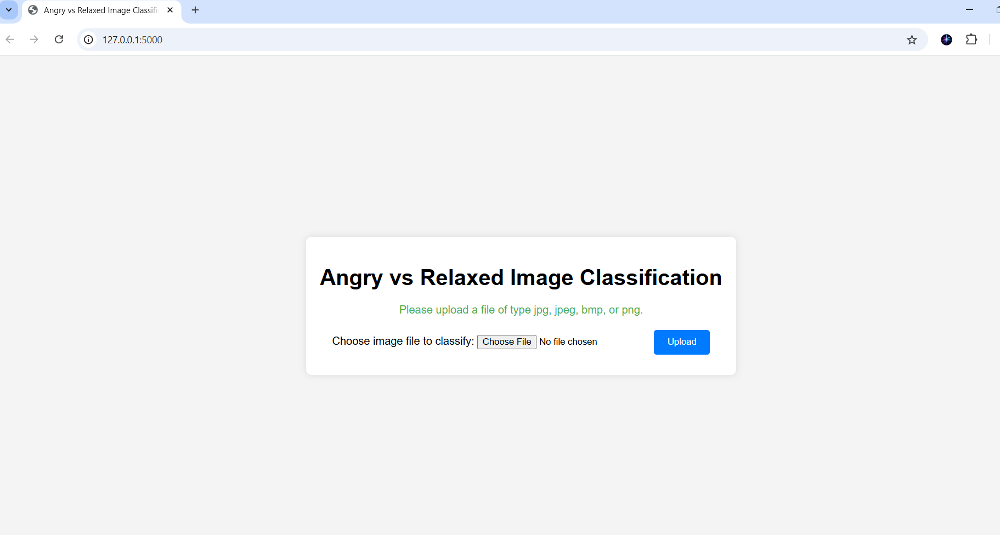
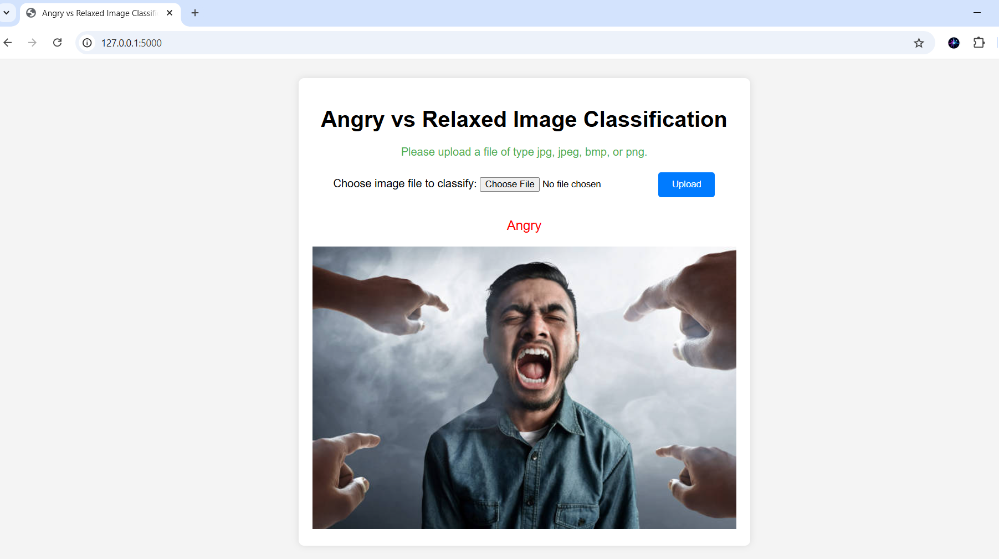

# <h1 style="color:red;">Angry - <span style="color:skyblue;">Relaxed</span> <span style= "color:white;">Image Classification</span></h1>

- This project is a deep learning-based image classification system designed to categorize images into Angry and Relaxed emotions. 
- It leverages `Convolutional Neural Networks (CNNs)` for image feature extraction and classification, coupled with `TensorFlow` for model training and evaluation. 
- The system utilizes `OpenCV (cv2)` for computer vision tasks such as image preprocessing, resizing, and augmentation, ensuring high-quality input for the neural network.


### Sample Angry Image


### Sample Relaxed Image


## <h2 style="color:skyblue;">Project Overview</h2>

The project comprises the following key components:

1. **Data Collection**:  
   - Images representing "Angry" and "Relaxed" feelings were collected from Google using the "Download All Images" Chrome extension.  
   - These images were manually reviewed and organized into the `data/angry_images/` and `data/relaxed_images/` folders for training.  

2. **Deep Learning Model**:  
   - A `convolutional neural network (CNN)` was trained in Google Colab to classify images into "Angry" or "Relaxed" categories.
   - The model is implemented using `TensorFlow`, leveraging its powerful tools for building, training, and evaluating deep learning models.  
   - The trained model is saved in the `models/` folder as `angry_classification.keras` and tracked using DVC to ensure reproducibility.  

3. **Computer Vision Integration** :
- The project utilizes `OpenCV (cv2)` to handle image preprocessing tasks such as resizing, color normalization, and augmentation to improve model accuracy and generalization.

4. **Flask Web Application**:  
   - A user-friendly interface was developed using Flask to allow users to upload images and classify them into either the "Angry" or "Relaxed" category.  
   - The Flask application (`app.py`) allows users to upload images and classify them as `Angry` or `Relaxed`.
   - The application displays both the uploaded and classified images directly on the web page.  

5. **Version Control**:  
   - Due to their size, datasets and models are excluded from the Git repository but are tracked using `DVC`.  
   - This ensures version control and easy reproduction of the workflow without compromising storage. 
   - Other all remaining files are added to git repository. 


## <h2 style="color:skyblue;">Project Structure</h2>

```
angry_relaxed_images_classification/
├── .dvc                      # DVC configuration files
├── logs/                     # Logs for monitoring the system
├── data/                     # Training and testing data (tracked by DVC)
│   ├── angry_images/         # Images of "Angry" category for training
│   ├── relaxed_images/       # Images of "Relaxed" category for training
│   ├── test_images/          # Images for testing the model
├── models/                   # Trained deep learning models (tracked by DVC)
│   ├── angry_classification.keras  # The trained model file
├── static/                   # Static files for the web page
│   ├── uploads/              # Uploaded images during testing
│   ├── images/               # Images for project description in README.md
│       ├── web_page_interface.png
│       ├── result_example.png
│       ├── angry_sample.png
│       ├── relaxed_sample.png
├── templates/                # HTML templates for the web page
├── .gitignore                # Git ignore file
├── .dvcignore                # DVC-specific ignore file
├── README.md                 # Project documentation
├── angry_classification.ipynb  # Initial notebook for model exploration
├── model.ipynb               # Google Colab notebook for training the model
├── app.py                    # Flask web application code
├── data.dvc                  # DVC tracking file for data
├── models.dvc                # DVC tracking file for models
├── requirements.txt          # Python dependencies

```

## <h2 style="color:skyblue;">Steps to Set Up the Project</h2>
### Step 1: Download Images
- First, we need to download angry and relaxed images for your dataset. 
- To simplify the process, use the **'Download All Images' extension** in our chrome browser. 
- This extension allows us to download multiple images from Google Search based on the keywords we specify. 
- Organize the images into two folders: `angry_images` and `relaxed_images`, and save this two folders in the data folder as `data/angry_images` and `data/relaxed_images`.


### Step 2: Set Up Git Repository
#### 2.1. Git initialize:
- To initialize a Git repository for the project, run the following commands:

```
git init
```
- This command initializes a new Git repository in the current directory, creating a .git directory to track changes. 
- It’s the first step in version controlling your project.

#### 2.2. Add a Remote Repository:
- add a remote repository to link our local Git repository to a remote server (e.g., GitHub, GitLab, etc.):
```
git remote add origin <repository_url>
```
- This commands allows us to push our changes to remote server.

### Step 3: Create and Activate a Conda Environment
#### 3.1. Create a new Environment:
- To create a new Conda environment for your project, run:
``` 
conda create -n <environment_folder_name> python=<python version> -y
```
- We can use any name as our environment name, for example i have used `venv` name and `3.9` python version:
   ``` conda create -n venv python=3.9 -y ```
-This command creates a new Conda environment called `venv` with Python `3.9` installed. 
- The `-y` flag automatically answers `yes` to the prompt asking for confirmation.

#### 3.2. Activate Virtual Environment:
- To activate the Conda environment, use:
```
conda activate angry_relaxed
```
- This command switches our current terminal session to the `venv` environment. 
- All Python and library installations will be isolated within this environment.

### Step 4: Install Dependencies
- After activating the environment, install the required dependencies by running:
```
pip install -r requirements.txt
```
- This command installs all the Python packages specified in the `requirements.txt` file, 
- Ensuring that your environment has all the necessary libraries to run the project. 
- These libraries may include TensorFlow, Flask, DVC, and other essential packages.


### step 5: Steps to Train the Model
####  5.1: Download Images for Training
- For training the model, we have to use fdownloaded  images for the Angry and Relaxed categories which are stored in `data` folder as `data/angry_images` and `data/relaxed_images'
- We have to use one more folder , that contains images for testing then deep learning model after we trained it.

#### 5.2: Upload Data to Google Colab
- Open a new notebook ipynb file and rename it as `model.ipynb` in Google Colab.
- Upload the `data/` folder with `test_images` folder to Colab.
- Adjust the file paths in the notebook to match the Colab environment.
#### 5.3: Train the Model
- Write and Execute all cells in the `model.ipynb` notebook to train the `CNN (Convolutional Neural Network)` model.
- After training, save the model as `angry_classification.keras` and download it.
- Upload the trained model to the `models/` folder in your local project directory.

### Step 6: Steps to Run the Application
#### 6.1. Start the Flask Application
- Use following command to run the `app.py` in terminal to start the Flask web server:
```
python app.py
```
#### 6.2. Open the Web Application
- Open our browser and navigate to ` http://127.0.0.1:5000 `to access the application.

- see the web page for this classification, 
 - #####  Web Page Interface and image upload Example
<p align="center">
  
  
</p>

#####  Classification Result Example

### Step 7: Set Up DVC for Data and Model Tracking
- DVC (Data Version Control) helps manage large files like datasets and machine learning models. 
#### 7.1. Initialize DVC: 
- First, initialize DVC in your project directory:
```
dvc init
```
- This command initializes DVC in your project and creates the necessary configuration files.
#### 7.2. Remote Storage For DVC:
- To set up remote storage for DVC, use:
``` 
dvc remote add -d <remote_name> <remote_storage_url>
```
- we have to replace <remote_name> with the name of your remote storage and <remote_storage_url> with the URL of our DVC storage (e.g., Amazon S3, Google Drive, etc.).
- If you do not have access to AWS, Google Drive, or any other cloud storage, we can use a local directory as the remote storage for DVC. 
   - Examples for various cloud storage providers:
      - 1. Amazon s3:  `dvc remote add -d my_s3_remote s3://mybucket/myfolder`
      - 2. Google Drive (using dvc-gdrive plugin): `dvc remote add -d my_gdrive_remote gdrive://<folder-id>`
      - 3. Azure Blob Storage: `dvc remote add -d my_azure_remote azure://mycontainer/myfolder`
      - 4. Google Cloud Storage: `dvc remote add -d my_gcs_remote gs://mybucket/myfolder`
   -  Set Authentication Credentials:
      - Each cloud provider requires authentication credentials, which should be securely stored. Examples:
           - Amazon S3: Configure `AWS_ACCESS_KEY_ID` and `AWS_SECRET_ACCESS_KEY` as environment variables.
           - Google Drive: Use a service account key or log in through the `dvc-gdrive` plugin.
           - Azure Blob Storage: Set `AZURE_STORAGE_CONNECTION_STRING` as an environment variable.
#####  Set Up Local Remote for DVC
- Here's how to set it up:
##### 7.2.1. Create a Directory for DVC Remote Storage: 
- Choose a location on your file system where you want to store the remote data. 
- For example, create a directory named dvc_remote outside your project folder.
```
mkdir ../dvc_remote
```
##### 7.2.2. Add the Local Remote to DVC: 
- Use the dvc remote add command to configure the local directory as the remote storage.
```
dvc remote add -d local_remote ../dvc_remote
```
- `local_remote`: The name of the remote (you can choose any name).
- `../dvc_remote`: The relative path to the directory where the remote data will be stored.


#### 7.3. Track Large Files with DVC:
- After dvc initialize and remote storage, next we have to track your large files with DVC.
- For example, to track the dataset, run:
```
dvc add <filename or foldername/>
```
- This command tracks our large file or folder, in this projects I have tracked `data/` and `models/` folders by dvc as they are having large size.
- So for this project I use `dvc add data/` and `data add models/` to track those to folders.
- This command tracks the `data/` and `models/` directories with DVC, which will allow us to version control the dataset and deep learning model efficiently.

##### 7.3.1 Push Data to the Local Remote or any other cloud storage: 
- After configuring the remote, push the tracked data to the remote storage.
```
dvc push
```
##### 7.3.2. Verify the Remote or Cloud Storage Setup: 
- Confirm that the data files are stored in the `../dvc_remote` directory and that your project is correctly referencing the remote.
- Confirm that your data files are successfully uploaded to the cloud remote.
    - For Example:
       - 1. For S3: Check the bucket contents using AWS CLI or the AWS Management Console.
            ```
             aws s3 ls s3://mybucket/myfolder/
            ```
       - 2. For Google Drive: Verify the files in the specified Google Drive folder.
       - 3. For Azure Blob Storage: Check the container contents using Azure CLI.
            ```
            az storage blob list --container-name mycontainer
            ```
- Switching Between Cloud and Local Remotes:
    - we can switch between configured remotes easily:
    ```
    dvc remote default <remote_name>
    ```
    - This allows us to maintain both local and cloud-based remotes for flexibility. 

### Step 8: Add and Commit Changes to Git
#### 8.1. Add all files to git :
- After setting up the project and tracking your data with DVC, add the changes to Git:
```
git add .
```
- This command stages all the changes made in the project, including the `.dvc` files that are used to track large files.(ex. data.dvc   and models.dvc, .dvcignore)
- We can add each file separately with commit message for each.
```
git add <filename or foldername/>
```

#### 8.2. Commit the changes:
- After adding files or folders to git, we have to commit the changes, with following command:
```
git command -m "< Commit message >"
```
-This command commits the staged changes to your local Git repository with a message indicating the setup.
- For example : `git commit -m "adding all files and dvc tracked files"`

#### 8.3. Check Branch Name of Git:
- To check the git branch to push our changes , use following command, which gives us the branch name, that we use to push our changes.
```
git branch
```

#### 8.4. Push Changes to Git:
- Finally, push your changes to the remote Git repository:
```
git push origin <branch_name>
```
- Assume `git branch` gives us the branch name as `main` or `master`, then we use following command to push
- `git push origin main` or `git push origin master`.
- This command pushes the committed changes to the `main` or `master` branch of your remote repository, keeping your project backed up and synchronized.


## <h2 style="color:green;">Final Note</h2>

1. **Check the Repository**:
   - Visit the remote repository to confirm that all changes (e.g., `README.md`, images, code) are updated successfully.

2. **Run the Application**:
   - Clone or pull the repository on another system to test if the setup and application work as intended.
   - Follow the setup instructions provided above.

3. **Collaborate or Share**:
   - Share the repository link with team members or on platforms like LinkedIn, GitHub Profile, or portfolio.

4. **Future Changes**:
   - Remember to update the `README.md` file whenever significant changes are made to the project structure or features.
